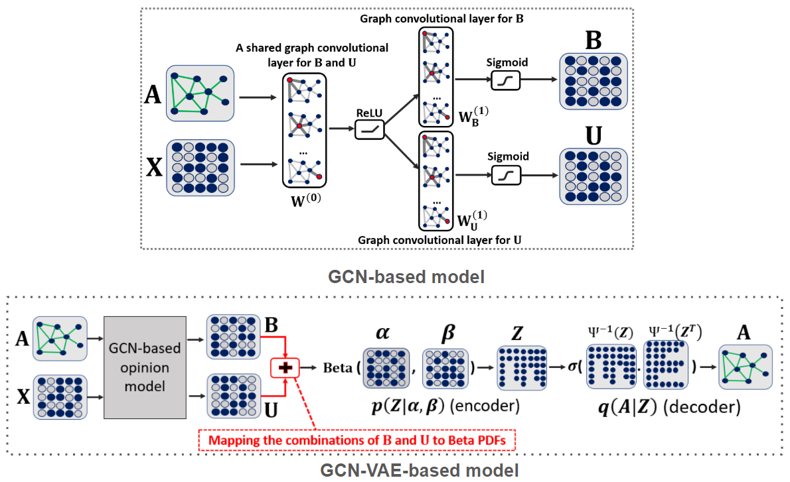

# GCN-VAE

This is a TensorFlow implementation of the GCN-VAE-based model as described in our paper:
 
Xujiang Zhao, Feng Chen, Jin-Hee Cho [Deep Learning based Scalable Inference of Uncertain Opinions], ICDM (2018)

GCN-VAE-based model are end-to-end trainable neural network models for uncertain opinions prediction in a large-scale network data.. 




## Installation

1. Clone this repository.
   ```sh
   git clone https://github.com/zxj32/GCN-VAE-opinion
   cd GCN-VAE-opinion
   ```

2. Install the dependencies. The code should run with TensorFlow 1.0 and newer.
   ```sh
   pip install -r requirements.txt  # or make install
   ```

## Requirements
* TensorFlow (1.0 or later)
* python 2.7
* networkx
* scikit-learn
* scipy

## Run the demo

```bash
python gcn_vae_epinion.py
```

## Data

In order to use your own data, you have to provide 
* an N by N adjacency matrix (N is the number of nodes), and
* an N by D feature matrix (D is the number of features per node) -- optional

Have a look at the `load_data()` function in `input_data.py` for an example.

In this example, we load epinioin data. The original datasets can be found here (epinion data): http://www.trustlet.org/downloaded and here (traffic data): http://inrix.com/publicsector.asp


## Models

You can choose between the following models: 
* `GCN-based`: gcn_vae_epinion.py
* `GCN-VAE-based`: gcn_epinion.py

## Cite

Please cite our paper if you use this code in your own work:

```
@article{xujiang2018gcn_vae,
  title={Deep Learning based Scalable Inference of Uncertain Opinions},
  author={Xujiang Zhao, Feng Chen and Jin-Hee Cho},
  journal={ICDM},
  year={2018}
}
```
